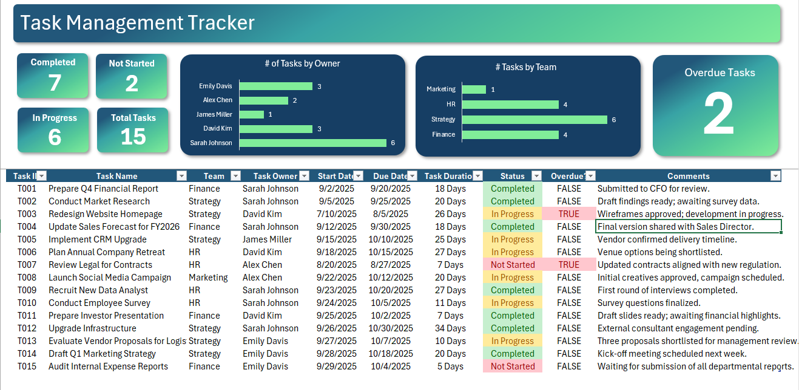

# Task_Management_Tracker--Excel
An interactive Excel dashboard designed to track project and task progress across teams and owners. It provides clear visual insights into task status, overdue items, and team workload distribution — helping managers monitor deadlines and performance effectively.  Key Highlights:  📊 Tracks Completed, In Progress, and Not Started tasks

  

  

  

